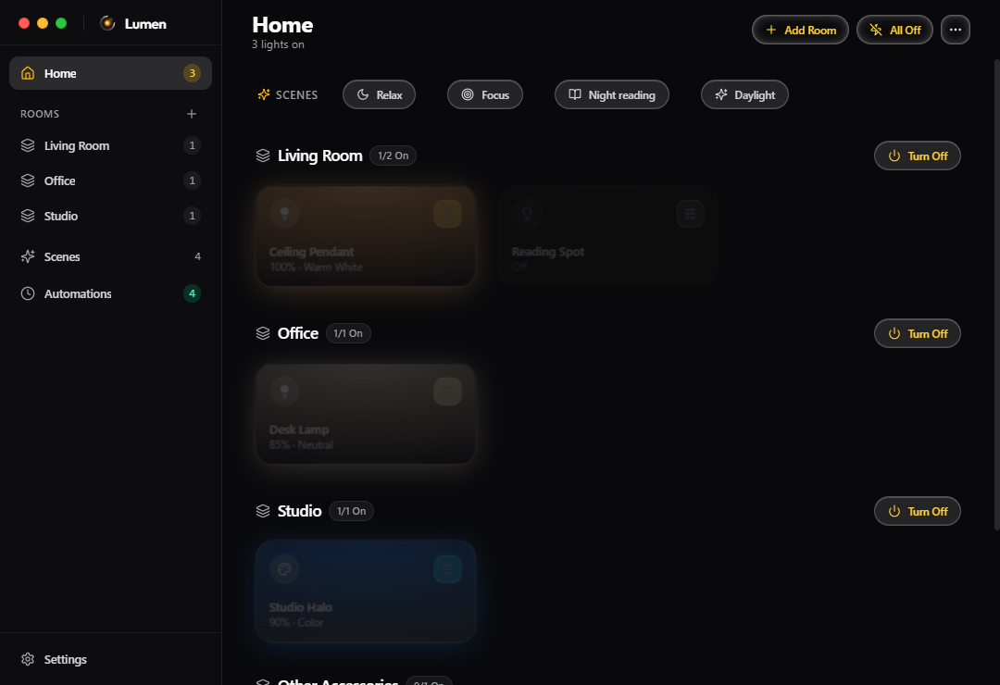
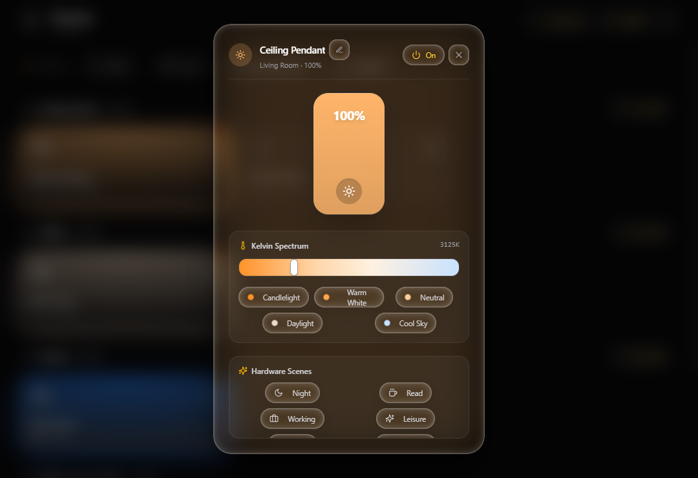
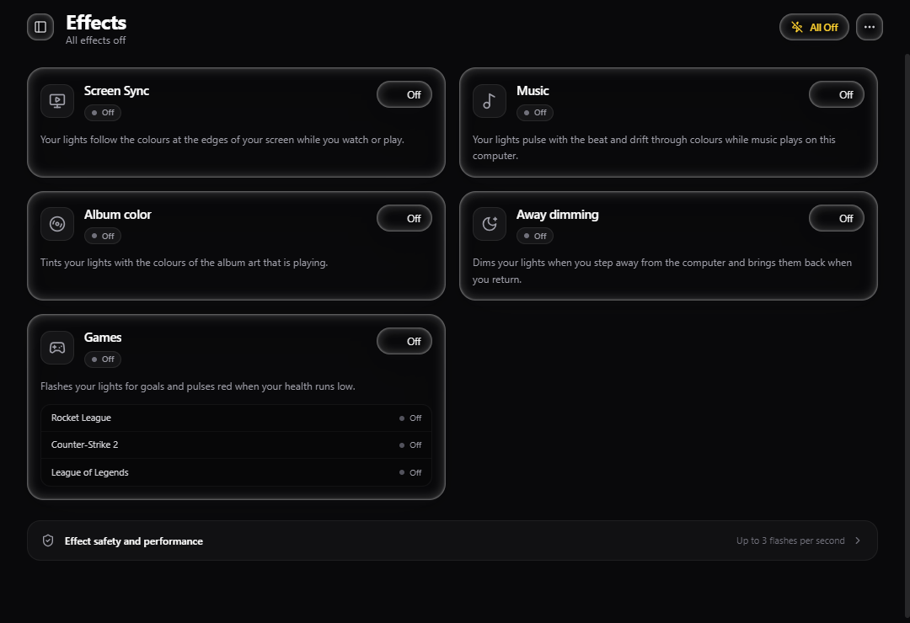
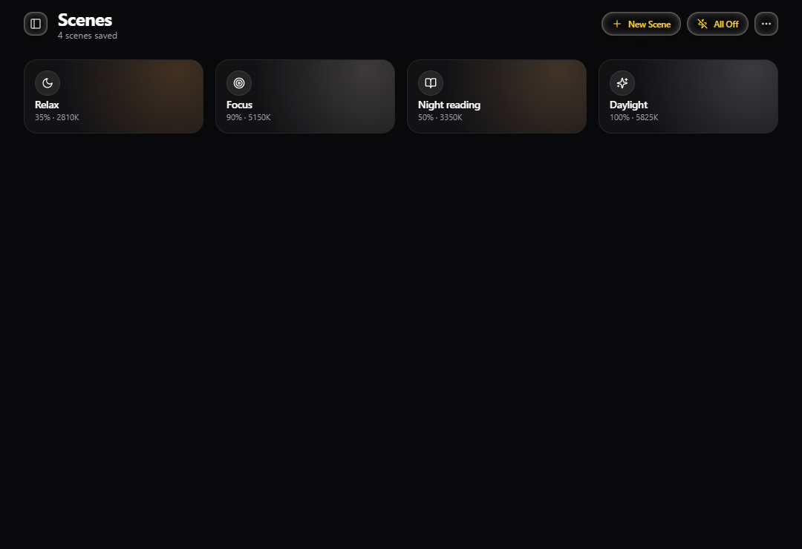
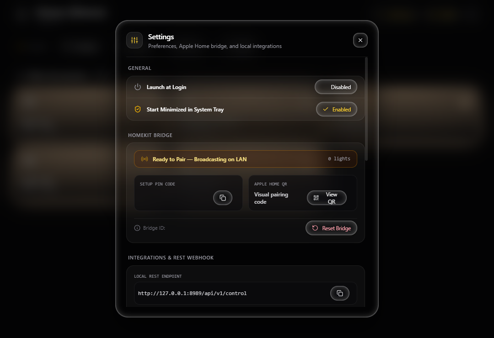
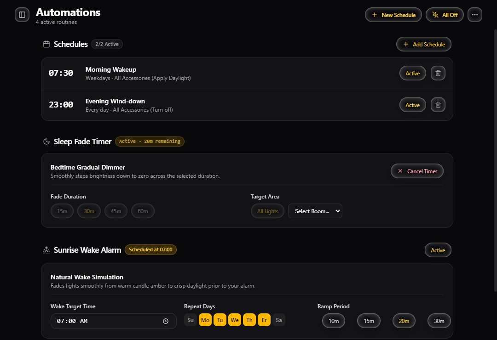
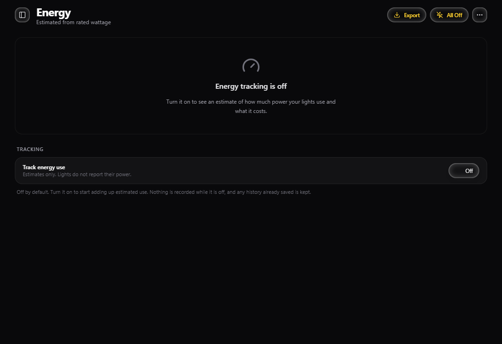

<p align="center">
  
</p>

<h3 align="center">Local control for Tuya smart lights, with Apple HomeKit built in.</h3>

<p align="center">
  Direct LAN control with no cloud at runtime, effects that follow your screen, music and games,<br>
  and a quiet background footprint.
</p>

<p align="center">
  <a href="https://github.com/TalibIbrahim/Lumos/releases"></a>
  
  
</p>

<p align="center">
  <a href="#features">Features</a> &middot;
  <a href="#install">Install</a> &middot;
  <a href="#setup-for-your-own-lights">Setup</a> &middot;
  <a href="#apple-homekit-setup">HomeKit</a> &middot;
  <a href="#effects">Effects</a> &middot;
  <a href="#performance">Performance</a> &middot;
  <a href="#troubleshooting">Troubleshooting</a> &middot;
  <a href="#build-from-source">Build</a>
</p>

<p align="center">
  
</p>

---

## Why Lumos

| | |
|---|---|
| **Local and fast** | Commands go straight to your lights over your own network. Nothing is sent to a server, and a command reaches a light in tens of milliseconds. |
| **Lights that react** | Screen Sync, Music, album art colours and game events (Rocket League goals, low health in Counter-Strike 2 and League of Legends) all drive your lights live. |
| **Works with Apple Home** | Lumos publishes your lights as a HomeKit bridge, so Siri, the Home app and automations can control them. |
| **Quiet in the background** | Hidden in the tray with nothing running, Lumos uses about 0.01% CPU and no GPU. See [Performance](#performance). |
| **Safe for your bulbs** | An optional Bulb protection mode caps commands, flashes and power changes per second so a bulb's controller is never pushed hard. |

---

## A Closer Look

<table>
  <tr>
    <td align="center"><br><sub>Per-light controls</sub></td>
    <td align="center"><br><sub>Effects</sub></td>
  </tr>
  <tr>
    <td align="center"><br><sub>Scenes</sub></td>
    <td align="center"><br><sub>Settings and HomeKit</sub></td>
  </tr>
  <tr>
    <td align="center"><br><sub>Automations</sub></td>
    <td align="center"><br><sub>Energy estimates (opt in)</sub></td>
  </tr>
</table>

The window scales down to 760 by 520 pixels and up to any size.

---

## Features

### Control
- **Precision controls**: power, brightness from 1 to 100%, colour temperature from 2200K to 6500K, and a full colour wheel.
- **Rooms**: group lights with synchronized dimming and a room master switch.
- **Scenes**: Reading, Relax, Focus, Night and your own presets.
- **Automations**: schedules by time and weekday, a gradual sleep timer and a sunrise wake-up alarm.
- **System tray**: quick toggles from the Windows tray, with the app running quietly behind it.

### Effects
- **Screen Sync**: lights follow the edges of your screen.
- **Music**: lighting that moves with what you play, including a Party style that reacts to drops.
- **Album color**: lights take the colours of the album art that is playing.
- **Away dimming**: lights dim when you step away.
- **Games**: Rocket League goal flashes and a low-health pulse for Counter-Strike 2 and League of Legends.
- **Effect safety**: a flash limiter for photosensitivity, and optional [Bulb protection](#photosensitivity) for the hardware.

See [Effects](#effects) for how each one works.

### Integrations
- **Apple HomeKit bridge**: control lights from iPhone, iPad, Mac, Apple Watch and Siri.
- **Local webhook**: a token-protected HTTP endpoint on `127.0.0.1` for automations, notifications and flashes.
- **More than one computer**: share one set of lights between computers with an encrypted link. See [Control from More Than One Computer](#control-from-more-than-one-computer).
- **Energy estimates**: optional, off by default. Estimated use per light with daily history, cost and CSV export. See [Energy](#energy).

---

## Performance

Measured on the packaged Windows build with real lights connected.

| | |
|---|---|
| **Hidden in the tray, nothing running** | About 0.01% CPU, no GPU use, and no animation or render work. Memory holds steady. |
| **What wakes it up** | Only the bulb heartbeats (every 10 seconds per light) and reconnects. Extra listeners and timers run only when they have something to do. |
| **Dragging a slider** | 60 frames per second on tiles and the detail sheet. |
| **Command latency** | A command reaches the light in under a millisecond of Lumos time. Most lights answer within about 30 to 100 ms. |
| **Install size** | The app archive is 15 MB, down from 55 MB. |

Energy tracking and Bulb protection are off by default, and a disabled effect does no work.

---

## Install

Download the latest installer from the [Releases](https://github.com/TalibIbrahim/Lumos/releases) page. It is a Windows 64-bit installer named `Lumos-Setup-<version>.exe`.

1. Download the installer from the latest release.
2. Run it.
3. **Windows SmartScreen:** the installer is not code signed, so SmartScreen may show a warning. Choose **More info**, then **Run anyway**.
4. Launch Lumos from the Start Menu or the desktop shortcut.

Lumos checks GitHub Releases for updates and tells you when one is available.

You will then need your lights' local keys. The steps are in [Setup for Your Own Lights](#setup-for-your-own-lights).

---

## Setup for Your Own Lights

Lumos controls Tuya and Smart Life compatible Wi-Fi lights over your local network. Follow these steps to generate your device configuration:

### Step 1: Pair Bulbs in Smart Life / Tuya Smart App
Ensure your bulbs are connected to your 2.4 GHz Wi-Fi network using the standard **Smart Life** or **Tuya Smart** mobile app.

### Step 2: Create a Tuya Cloud Developer Project
1. Register for a free account at the [Tuya IoT Platform](https://iot.tuya.com/).
2. Create a new **Cloud Project** (select **Smart Home** industry). Choose the Data Center that matches your mobile app account region.
3. Authorize the **IoT Core** and related authorization APIs for your project under **Service API**.
4. Link your mobile app account under **Devices** > **Link Tuya App Account** by scanning the displayed QR code with your Smart Life / Tuya Smart app.

### Step 3: Extract Device Keys with TinyTuya
Use the open-source [TinyTuya](https://github.com/jasonacox/tinytuya) tool to retrieve your local encryption keys and IP addresses:

```bash
pip install tinytuya
python -m tinytuya wizard
python -m tinytuya scan
```

The wizard will connect to your developer project, fetch the device names, IDs, and local keys, and output a `devices.json` file.

### Step 4: Import Configuration into Lumos
On first launch, Lumos presents an onboarding screen. You can:
- Drag and drop or browse to your generated `devices.json` file.
- Or manually place `devices.json` in the application data folder:
  - **Windows**: `%APPDATA%\Lumos\devices.json`
  - **macOS**: `~/Library/Application Support/Lumos/devices.json`
  - **Linux**: `~/.config/Lumos/devices.json`

### Device Configuration Format

The `devices.json` file follows the standard TinyTuya format. Example with placeholder values:

```json
[
  {
    "name": "Desk Lamp",
    "id": "bf0123456789abcdef0123",
    "key": "0123456789abcdef",
    "ip": "192.168.1.50",
    "mac": "00:11:22:33:44:55",
    "version": "3.3",
    "category": "dj",
    "mapping": {
      "20": { "code": "switch_led", "type": "Boolean" },
      "21": { "code": "work_mode", "type": "Enum" },
      "22": { "code": "bright_value_v2", "type": "Integer", "values": { "min": 10, "max": 1000 } },
      "23": { "code": "temp_value_v2", "type": "Integer", "values": { "min": 0, "max": 1000 } },
      "24": { "code": "colour_data_v2", "type": "Json" }
    }
  }
]
```

---

## Apple HomeKit Setup

Lumos includes an integrated HomeKit bridge that exposes your local fixtures as native HomeKit accessories.

1. Open Lumos and click the **Settings** gear icon in the titlebar.
2. In the **Apple HomeKit** section, note the QR code and the 8-digit setup code (formatted `XXX-XX-XXX`).
3. Open the **Apple Home** app on your iPhone or iPad.
4. Tap **+** > **Add Accessory**, then scan the QR code displayed on screen or select **More options...** and enter the setup code manually.
5. Assign each light to its room and complete setup.

### Requirements & Network Notes
- **Firewall**: When prompted by Windows Defender Firewall, allow Lumos network access on Private networks.
- **Subnet**: Your PC and iOS device must be connected to the same local Wi-Fi subnet for mDNS discovery.
- **Remote Access**: Controlling accessories outside your home network or executing time-based HomeKit automations requires an Apple Home Hub (Apple TV or HomePod) on your network.

---

## Local Webhook Integration

Lumos provides an embedded HTTP webhook server listening on `127.0.0.1:8989` for local automations, notifications, and visual flash alerts.

### Authentication
Requests must use `127.0.0.1`, `localhost`, or `[::1]` as the host; any other `Host` header gets a 403, which blocks DNS rebinding from web pages. Requests also require a Bearer token in the `Authorization` header. You can view or copy your unique token in **Settings** > **Local Webhook**.

### Endpoints

#### POST `/webhook`
Trigger light flashes or state modifications.

**Request Headers:**
```http
Content-Type: application/json
Authorization: Bearer YOUR_WEBHOOK_TOKEN
```

**Request Payload:**
```json
{
  "flash": true,
  "color": "#ff0000",
  "count": 3,
  "duration": 200,
  "targets": ["bf0123456789abcdef0123"]
}
```

- `flash` (boolean): Whether to execute a flash alert sequence.
- `color` (string, optional): Hex color code for the flash (e.g., `"#3b82f6"` for blue).
- `count` (number, optional): Number of flash pulses (default: `2`).
- `duration` (number, optional): Flash pulse duration in milliseconds (default: `150`).
- `targets` (string[], optional): Array of device IDs to target. Omit to flash all online lights.

#### Example: Trigger Alert via cURL
```bash
curl -X POST http://127.0.0.1:8989/webhook \
  -H "Content-Type: application/json" \
  -H "Authorization: Bearer YOUR_WEBHOOK_TOKEN" \
  -d '{"flash": true, "color": "#00ff88", "count": 2}'
```

#### Example: Trigger Alert via PowerShell
```powershell
$headers = @{
    "Content-Type"  = "application/json"
    "Authorization" = "Bearer YOUR_WEBHOOK_TOKEN"
}
$body = @{
    flash = $true
    color = "#f59e0b"
    count = 2
} | ConvertTo-Json

Invoke-RestMethod -Uri "http://127.0.0.1:8989/webhook" -Method Post -Headers $headers -Body $body
```

#### Effect toggles

Each effect (`music`, `album`, `away`, `games`) can be switched with the same token:

- `GET /api/v1/effects` lists effects with their state.
- `POST /api/v1/effects/{id}/on`, `/off`, or `/toggle` switches one.
- `POST /api/v1/effects/{id}` with `{"enabled": true}` sets it explicitly.

```bash
curl -X POST http://127.0.0.1:8989/api/v1/effects/music/toggle \
  -H "Authorization: Bearer YOUR_WEBHOOK_TOKEN"
```

---

## Effects

The **Effects** page holds five effects. Each has an on/off toggle, a status (off, waiting, active, or needs attention), a choice of which lights it uses (all lights by default), and its own settings. Settings are saved in your user data folder (`effects.json`), and effects that were on when Lumos closed turn back on at launch unless you switch that off in **Effect safety**.

### How effects share your lights

Effects never send commands to lights themselves. A compositor in the main process combines your own settings with every active effect, one layer on top of another, highest priority last:

1. Away dimming (dims everything)
2. Game flashes and the low-health pulse
3. Screen Sync (on the lights it drives, Music and Album color step aside)
4. Music
5. Album color
6. Your own settings, scenes, and automations

When an effect ends, lights return to whatever the layers underneath show at that moment, not to a snapshot from when it began, so changes made in the meantime are kept. Changes between states fade smoothly.

All commands go through one queue per light with a budget of 12 commands per second (adjustable from 2 to 20 in **Effect safety**). When a light is busy, older frames are dropped and only the newest is sent. A single change you make by hand is always sent straight away.

**Changing a light's colour or brightness by hand** (in Lumos, from Apple Home, or through the webhook) takes that light out of Screen Sync, Music, and Album color. Switching it on or off does not. A short notice names the effect that paused, with a **Resume** button; you can also resume from the effect's settings. A light you change from your phone while the computer is away keeps your change when you come back.

### Photosensitivity

Light that changes quickly can affect people with photosensitive epilepsy. No effect in Lumos strobes. A global cap allows at most three flashes per second on any light (you can lower it to one or two, never raise it), counting both sudden brightness rises and sudden large colour jumps; anything faster is softened into a gradual change. **Reduce intensity** makes every pulse and flash gentler. Turn an effect off if anyone feels unwell.

**Bulb protection** (in **Effect safety**, off by default) is for keeping the load on the bulbs' small controllers low. While it is on, every light is held to at most 2 commands per second, 1 flash per second, and 1 power change every 2 seconds, whatever sends the command: the window, Apple Home, the webhook, the tray, effects, or another computer. Commands that arrive in between are combined, so a light still ends on your latest setting; fast drags and effects look slower and smoother. It does not change anything on the bulb itself.

### Control from Apple Home, Siri, and webhooks

Each effect appears in Apple Home as a switch named Screen Sync, Music mode, Album color, Away mode, and Game mode, so you can say "turn on Music mode". The same toggles are available on the local webhook (see below).

### Screen Sync

Your lights follow the colours at the edges of the screen while you watch or play. When an explosion lights up the right side of the picture in green, the light on your right turns green while the light on your left stays with whatever the left side shows.

**Light positions.** Give each light a position relative to the screen, either in the light's details or in Screen Sync's settings:

- **Left** and **Right** follow a vertical strip along that edge of the picture.
- **Top** and **Bottom** follow a horizontal strip along that edge.
- **Center** follows the whole picture.
- Lights that share a position split that part of the screen evenly between them.
- Lights left without a position are not used by Screen Sync. If no light has one, Screen Sync asks you to choose.

**Movie mode.** Turn on **Movie mode** (under Colour and brightness) for colour only. The lights always take the colour of the picture, so a bright warm scene stays warm instead of switching to plain white, and nothing dazzles you in a dark room. It is off by default, and while it is on it adds three options:

- **Turn off in dark scenes** (on by default): the light goes out when the picture is dark. Turn it off to keep dark scenes dim at the minimum brightness instead.
- **Movie brightness** (60% by default): the most the lights ever show, as a share of Maximum brightness. Lower it if you do not want to notice the lights during a film.
- **Fade back slowly** (on by default): when Screen Sync stops, or the computer locks, the lights ease back to your normal light over about six seconds and dip through darkness on the way, instead of snapping to bright white. A bulb's white mode is far brighter than its colour mode, which is why this matters.
- **Rise speed** (25 points per second by default): how fast brightness may increase, so a cut from a dark scene to a bright one brings the light up over a couple of seconds instead of at once. Getting darker is never slowed down.

Minimum brightness (except when dark scenes are kept dim) and Dim in dark scenes do not apply in Movie mode.

**How it works.** A hidden page captures the chosen display through Windows screen capture, asking for a small frame so the scaling happens before the pixels arrive, and reduces it to 160 by 90. It analyses up to 15 frames a second while the picture moves and 10 while it is still, and skips frames that barely changed. For each light's part of the screen it:

- leaves out black bars, so letterboxed films (for example 2.39:1) do not read as dark;
- picks the dominant vivid colour rather than a muddy average, weighting pixels by saturation and brightness, and falls back to a warm neutral white for grey or very dark areas;
- measures how bright that part of the picture is.

Lights react quickly to big changes (an explosion or a muzzle flash reaches the bulb in about 100 to 150 ms of processing) and smooth gentle changes over roughly half a second or more. A scene cut makes the lights snap to the new scene, and very small changes are not sent at all, so the lights do not flicker. Colours are adjusted for how RGB bulbs show them. Lights that cannot show colour follow brightness and use a warm white.

The picture is analysed on this computer as it plays. Frames are never saved, sent anywhere, or logged; a small preview is shown in the settings only while they are open.

**Modes and settings.**

- **Mode:** Cinema (smooth, with a longer fade), Gaming (fast), or Custom.
- **Sliders:** response speed, saturation boost, minimum and maximum brightness, edge width, and intensity.
- **Toggles:** ignore black bars (on by default), dim in dark scenes (on), and limit brightness changes (on).
- **Display:** choose which display to follow; if it disconnects, Screen Sync follows the main display until it returns, and it follows resolution changes on its own.
- **Live preview:** the settings show the captured picture with each light's area outlined and the colour each light is being sent, along with the measured delay from screen to light.
- **Keyboard shortcut:** optionally toggle Screen Sync from anywhere (Ctrl+Alt+S, Ctrl+Shift+S, or Ctrl+Alt+L). It is also in the tray menu, in Apple Home as a Screen Sync switch, and on the webhook as `/api/v1/effects/screen`.

Dark scenes dim the lights without turning them off. Set the minimum brightness to 0 if you want them to go off in black scenes.

**With other effects.** Screen Sync comes first among the ambient effects. On the lights it drives, Music and Album color step aside, and their cards say so; on lights without a position they carry on. When Screen Sync stops, starts, or a light leaves it, the lights fade from what they showed to what comes next instead of jumping. Away dimming and game flashes still take priority over Screen Sync. Changing a light's colour or brightness by hand takes it out of Screen Sync until you resume it; switching a light on or off does not.

**Latency.** Expect roughly 80 to 150 ms from a change on screen to the bulb, most of it the bulb itself: analysis takes about 1 ms per frame, and the bulbs used in testing answered in about 30 to 40 ms. Lumos measures each bulb's reply time while running and sends a slow bulb fewer updates rather than letting them pile up. The measured delay is shown in Screen Sync's settings.

**Performance.** On a typical 8-core computer, Screen Sync used about 1.2 percent of the processor at 15 frames a second with a moving picture, and less when the picture was still. When it is off, nothing runs: no capture, no hidden page, and no timers. Capture also stops while the computer is locked or asleep.

**Limitations.**

- **Protected video:** many streaming apps and hardware-protected video show only black to screen capture. Lumos does not try to get around this. When the picture stays black while you are clearly using the computer, Screen Sync says so. Playing the video in a web browser with hardware acceleration turned off, or using another source, usually works.
- **Exclusive full-screen games** often cannot be captured. Screen Sync notices and suggests switching the game to borderless windowed mode.
- **HDR:** Windows hands screen capture a standard-range picture, so very bright highlights may look flatter on the lights.
- **Remote desktop:** in a remote session Lumos sees the remote session's screen, which may update slowly.
- **Display scaling** is handled; the capture always uses the display's real resolution.
- **Bulb colours:** RGB bulbs cannot show every colour the screen can. Deep blues and purples tend to be dimmer than the screen, and pale colours look closer to white.
- Screen Sync is available on Windows.

The brightness-change limiter caps how often brightness can swing by a large amount, in either direction, so rapid flashes on screen cannot make the lights strobe. It works alongside the app-wide flash-rate cap described under Photosensitivity.

### Music

Your lights follow the music playing on this computer. Beats become brightness pulses shaped to what bulbs can follow (a quick rise and a smooth fall, never a strobe), and colour drifts through a colour set at a pace tied to how energetic the track is. Colours can move from light to light like a wave.

There are two styles:

- **Smooth** (the default): gentle pulses and slowly drifting colours.
- **Party**: the lights snap to each beat, step to the next colour, and sit dark in between. When the beat drops (the bass comes back hard after a build-up or breakdown), every light goes full white for a moment, and each beat after that hits full brightness for about 16 seconds. The flash limit still applies, and with reduced intensity on, the white burst is skipped.

- **Setup:** none. Lumos listens to the system output using Electron's loopback audio capture on Windows.
- **Settings:** sensitivity, colour set (Aurora, Sunset, Ocean, Neon, or your own), style, pulse strength (in Party, how dark the lights go between beats), colour drift, most beats per second (at most the safety cap), and **Pause when the music stops**: after that many seconds without sound, Music lets go and your lights return to how they were, then picks up again as soon as something plays. The settings sheet shows a live level meter to help you tune sensitivity.
- **How it works:** a hidden window analyses the sound at about 31 frames per second: an FFT, a low-band (kick and bass) envelope, beat detection from spectral flux with an adaptive threshold, a tempo estimate used to shape the pulse, an overall loudness level, and drop detection (a beat where the bass jumps well above where it has sat for the last few seconds, at most one every 8 seconds). Only these numbers reach the rest of the app.
- **Privacy:** no audio is recorded, stored, or sent anywhere.
- **Limitations:** Windows only. System sounds count as audio too. Bulbs vary in how fast they react, so very fast music is followed by brightness rather than every beat.

### Album color

Your lights take on the colours of the album art for whatever is playing: Spotify, Apple Music, web browsers, and most players that show up in the Windows media controls.

- **Setup:** none.
- **Settings:** use up to three colours from the art across your lights, and how long after playback stops or pauses the lights return to normal.
- **How it works:** Lumos reads the current media session through the Windows System Media Transport Controls using a small helper program that ships with Lumos. The thumbnail is reduced to 48 by 48 pixels and analysed in a background thread: colours are grouped, near-black and near-grey pixels are ignored, colours are weighted by both how much of the art they cover and how saturated they are, and the winner is made more saturated and brighter so it reads well on a bulb. Black and white art gives warm white. Changes cross-fade over about 1.5 seconds.
- **With Music:** when both are on, Album color supplies the colour and Music adds the beat pulses on top.
- **Privacy:** album art is kept in memory only. Track titles and artists never leave the helper; Lumos sees only an anonymous track identifier.
- **Limitations:** Windows 10 or later. Players that do not publish album art to Windows are not tinted.

**Why a helper program:** Windows exposes the media session through WinRT. The options were a NodeRT binding (a native module that must be rebuilt for every Electron version and is no longer maintained), a PowerShell bridge (slow to start, blocked by some execution policies, and unable to read the album art reliably), or a small helper. Lumos uses a helper written in C# and compiled during the build with the compiler that comes with the .NET Framework on every Windows 10 and 11 installation, so nothing extra is needed to build or run it. It also reports the system output level and whether a full-screen app is open, which Away dimming uses.

### Away dimming

Lights dim or turn off when you step away from the computer and come back when you return.

- **Setup:** none.
- **Settings:** how long without activity before dimming (default 5 minutes), whether to dim or turn off, the dim level, what to do when the computer locks or sleeps (dim, turn off, or nothing), whether to stay on while media plays, and whether lights come back gently or straight away.
- **How it works:** Lumos watches lock, unlock, sleep, and wake events and checks idle time occasionally (every 15 seconds at most while you are present, every second while away so lights return quickly). It does not dim for inactivity while music or video is playing, while sound is coming from the speakers, or while a full-screen app is open (on by default).
- **Limitations:** locking and sleep apply even while media plays, because they are deliberate.

### Games

Flashes for goals and a red pulse when your health runs low, using only the games' official local interfaces. Lumos never reads game memory, injects anything, or draws overlays.

#### Rocket League goal flash

Uses the official Rocket League Stats API, which the game serves over a local WebSocket (`ws://localhost:49124` by default) once it is switched on.

1. In **Effects > Games**, Lumos lists the Rocket League installs it found (Steam and Epic). Choose **Turn on** to set `PacketSendRate` in `<install folder>\TAGame\Config\DefaultStatsAPI.ini`. Lumos edits only that setting and the port, backs up the original file next to it (`DefaultStatsAPI.ini.lumos-backup`), and offers **Undo**. If the game folder is protected, Windows asks for permission.
2. Restart Rocket League. The setting is read only when the game starts.
3. Play. Lumos works out which team you are on by itself: the Stats API sends live car details (boost, speed) only for players on your team, and while those are missing it uses the player the camera follows. You can also enter your in-game name; clan tags, capitals, and spacing are ignored. It is stored only on this computer.

While the effect is on, the settings show whether anything has arrived from the game, which team Lumos thinks you are on and how it knows, and whose the last goal was. If nothing has arrived, the Stats API is off: choose **Turn on** and restart the game.

To do it by hand, set `PacketSendRate` to a value above 0 (Lumos uses 10; the game caps it at 120) and `WebPort` (default 49124) in that file before launching the game.

- **Settings:** colour for your goals (or your team's colour), colour for opponent goals, number of flashes, flash length, time between goal flashes, a flash at kickoff, and win or loss colours when the match ends. If Lumos cannot tell whose goal it was (for example while spectating), it uses a neutral colour.
- **Connection:** Lumos connects when the game is running and reconnects automatically, checking every few seconds, when it launches or closes.

#### Low-health pulse: Counter-Strike 2

Uses Valve's official Game State Integration.

1. In **Effects > Games**, choose **Add config** for the install Lumos found. This writes `gamestate_integration_lumos.cfg` into `game\csgo\cfg` inside the Counter-Strike 2 folder. **Remove** deletes it again.
2. Restart Counter-Strike 2.

The game then posts its state to Lumos on `http://127.0.0.1:3123/`. Lumos listens only on loopback and only accepts posts that carry the random token written into the config file. The pulse uses your own health; the health of a player you are spectating is ignored.

#### Low-health pulse: League of Legends

Uses Riot's official Live Client Data API, which the game serves at `https://127.0.0.1:2999` during a match. There is nothing to set up. The game uses a certificate signed by Riot's own root certificate; Lumos checks the connection against that root instead of turning certificate checks off, and only ever connects to loopback. Lumos asks for your current and maximum health twice a second during a game and every five seconds otherwise.

#### How the pulse behaves

Below the threshold (default 30 percent health), lights pulse slowly in red (or your chosen colour). The pulse speeds up as health drops, from about 2.5 seconds per cycle at the threshold to about 0.7 seconds near zero, always within the flash-rate cap. It fades in, shows a brief dim red when you die, and eases back to normal when you heal or respawn. It runs only while you are alive in a match and stops when the game closes.

**Not supported:** Valorant and any game that would need memory reading, injection, or unofficial hooks to read health.

### Demo mode

In demo mode, Music plays a simulated 120 beats per minute track, and the settings sheets for Album color, Away dimming, and Games offer buttons to simulate a new track, stepping away, goals, and low health, so every effect can be tried without a game or real lights.

---

## Energy

The **Energy** page estimates how much electricity your lights use. Tuya lights do not report their power use, so **every figure is an estimate**.

Energy tracking is **off by default**. Open the Energy page and turn on **Track energy use** to start recording. While it is off, Lumos records nothing and does no background work for it, and any history already saved is kept.

- **Rated wattage:** enter each light's rated wattage, printed on its box or base (for example "9 W"). The default is 9 W, typical for a smart bulb.
- **Views:** today (per light), the last 7 days, and the last 30 days (per day), with a breakdown per light, total kWh, and hours on.
- **Cost:** add your electricity price per kWh and a currency symbol to see an estimated cost.
- **Export and reset:** export daily totals as CSV, or clear the history (with confirmation).

### Estimation model

For each light, based on what it is actually showing (including effects):

```
watts = rated watts x level(brightness) x mode factor        (0 when off or unreachable)
level(b) = 0.08 + 0.92 x b^1.4                               (b is brightness from 0 to 1)
mode factor = 1.0 for white, 0.55 for colour
```

LED drivers keep a small base load at low dim levels and draw a little less than proportionally in the middle of the range. Colour mode drives only the red, green, and blue emitters, which together draw less than the white emitters at full output. A light that cannot be reached counts as using nothing, because its state is unknown.

Lumos adds up energy whenever a light's output changes and stores compact daily totals per light (not a second-by-second log) in `energy.json` in your user data folder. Totals are saved every five minutes and on exit, so at most five minutes are lost if the app stops unexpectedly. About a year of history is kept.

---

## Control from More Than One Computer

Each Tuya light accepts only one direct local connection, so two computers running Lumos would fight over the lights. Instead, one computer keeps the connection to the lights and the others control them through it.

1. On the computer that should keep the lights (for example the one hosting the hotspot your lights use), open **Settings > Other computers** and turn on **Share these lights with other computers**. A six-digit pairing code appears. If Windows asks whether to allow Lumos on this network, allow it.
2. On the other computer, open **Settings > Other computers**, choose **Connect**, pick the computer from the list (or type its address), enter the code, and choose **Connect**.

From then on, the second computer stops connecting to the lights itself. Its lights, rooms, scenes, automations, effects, and energy all come from the first computer and stay in sync both ways, and it reconnects on its own after restarts, sleep, or address changes. Effects such as Music and Album color run on the first computer and follow what plays there. Choose **Stop using** to go back to connecting directly, and **Remove** on the first computer to unpair a computer.

**Security:** pairing needs the code shown on the sharing computer; each code works once, expires after 10 minutes, and five wrong codes lock pairing for 10 minutes. After pairing, the shared secret never crosses the network again: each connection proves it in both directions with an HMAC challenge, and every message is encrypted with AES-256-GCM using a fresh key per connection, with replayed messages rejected. Only addresses on private networks are accepted. Lumos listens on TCP port 8990 and announces itself on UDP port 8991 while sharing is on.

---

## Troubleshooting

### Device Shows Offline
- Verify that the light fixture is powered on at the physical wall switch.
- **After a power cut**, your router or hotspot may give the lights new addresses. Lumos listens for the announcements lights send every few seconds and switches to a light's new address (and protocol version) as soon as it hears one. If it hears nothing, it searches the local network for the light, confirming it with the light's own key, and saves the new address. To search straight away, choose **Refresh Status** or **Scan Subnet** from the toolbar's more menu.
- The light's status says why it is offline: **Searching** while Lumos looks for it, **In use elsewhere** when the light answers but another app holds its connection (see below), **Key changed** when the light announces itself but rejects the key Lumos has, or **No response** when nothing answers. Open the light for a fuller explanation.
- **Key changed** happens when a light is removed and added again in the Tuya or Smart Life app, which gives it a new key. Run `python -m tinytuya wizard` again and import the new `devices.json` in **Settings > Device Configuration**.
- Announcements are not passed between devices on every network. Windows Mobile Hotspot, for example, delivers them to the computer hosting the hotspot but not to other connected computers, and Windows Firewall may ask whether to allow Lumos the first time it listens. The network search works either way.
- You can also run `python -m tinytuya scan` to list current addresses.

### Protocol Version Mismatch
- Tuya devices communicate on protocol version 3.1, 3.3, 3.4, or 3.5. Ensure the `version` field in `devices.json` matches your device (usually `"3.3"` for standard Wi-Fi bulbs).

### Key Error or Decryption Failure After Re-pairing
- If a bulb is re-paired or reset in the Smart Life app, Tuya generates a new local key. You must re-run `python -m tinytuya wizard` to obtain the updated `key`.

### Multiple Local Connections Conflict
- Tuya Wi-Fi bulbs only accept **one** active local TCP connection at a time. A light that Lumos on one computer is connected to shows **In use elsewhere** on another computer running Lumos. To use more than one computer, turn on sharing on one of them and connect the others to it; see [Control from More Than One Computer](#control-from-more-than-one-computer).
- Other local controllers (Home Assistant, TinyTuya scripts) take the connection the same way. The Smart Life app itself uses the cloud and does not.

### Bulbs Not Showing Color Controls
- Only bulbs that report `colour_data_v2` or `colour_data` in their DPS mapping provide RGB color controls. White/CCT-only bulbs will show brightness and temperature sliders only.

### HomeKit Accessory Not Discovered
- Check that Windows Defender Firewall is not blocking the HomeKit bridge ports (51826–51850) or mDNS UDP port 5353. If port 51826 is reserved by Windows (Hyper-V / WinNAT), Lumos automatically selects the next available port in this range.
- Verify that your PC and iOS device are connected to the same subnet/VLAN without client isolation enabled, or that your iOS device is connected to the PC's Mobile Hotspot network.

---

## Build from Source

### Prerequisites
- Node.js 18.0.0 or higher (Node 22 LTS recommended)
- npm 9.0.0 or higher

### Build Commands

```bash
# Clone the repository
git clone https://github.com/TalibIbrahim/Lumos.git
cd Lumos

# Install dependencies
npm install

# Run type checks
npm run typecheck

# Run unit and integration tests
npm test

# Launch development build with hot reload
npm run dev

# Build Windows NSIS installer
npm run build:win
```

Installer output will be located in the `dist/` directory as `Lumos-Setup-<version>.exe`.

On Windows, `npm run build` also compiles the small media helper used by Album color and Away dimming (`native/media-helper`) with the C# compiler that ships with the .NET Framework, so no SDK is needed. To regenerate the album art test images, run `node scripts/generate-test-fixtures.js`. Command latency can be measured with `LUMOS_PERF=1 npx vitest run src/__tests__/perf`.

---

## Privacy and Security

- **Local Execution**: Lumos communicates directly with your lighting hardware over your local area network (LAN). No lighting telemetry or device commands are sent to external servers.
- **Secure Key Storage**: Device keys and HomeKit credentials remain strictly on your local machine in your OS user application data directory (`%APPDATA%/Lumos`).
- **Local Webhook**: The embedded webhook server binds strictly to the loopback interface (`127.0.0.1`) and requires Bearer token authentication for all requests.
- **No Telemetry**: Lumos collects no usage data or analytics.
- **Effects Stay Local**: Effects use only loopback connections: to the Rocket League Stats API socket, the Counter-Strike 2 game state listener, and the League of Legends Live Client API, all on `127.0.0.1`. Every payload from these sources is validated before use. Audio and album art are processed on this computer and never stored or sent; track titles and artists are never read by the app.
- **Official Interfaces Only**: Game integrations use only the games' official local interfaces. Lumos never reads process memory, injects code, or draws overlays.
- **Network Use Overall**: Apart from the loopback connections above, Lumos talks to your lights on your local network, publishes the HomeKit bridge on your local network, and checks GitHub Releases for app updates.

---

## Limitations

- Supports Tuya-based Wi-Fi bulbs and light strips that implement Tuya LAN protocol 3.1, 3.3, 3.4, or 3.5.
- Does not support Bluetooth-only or Zigbee bulbs without an active Tuya LAN gateway.
- Simultaneous local connections are limited by bulb firmware (one local controller at a time per bulb).
- Music and Album color are available on Windows only. Album color needs Windows 10 or later.
- On lights without colour, colour effects show as white: brightness still pulses and flashes, and the white temperature is chosen to match the colour's warmth where possible.
- While an effect is shaping a light, the light's own reports are treated as echoes of the effect, so a change made with a physical switch or another app during an effect is picked up only after the effect lets go of the light.
- The light tiles show your settings, with a label naming the effect that is currently shaping each light, rather than the effect's moment-to-moment colour.

---

## Contributing

Contributions are welcome. Please ensure that:
1. All changes pass TypeScript validation (`npm run typecheck`) and tests (`npm test`).
2. Design standards and UI consistency are maintained.
3. Code contains no proprietary secrets or personal identifiers.

---

## Acknowledgements

Lumos is built with the help of the following open-source projects:
- [React Bits](https://reactbits.dev/) - Glass surface and visual component primitives
- [hap-nodejs](https://github.com/homebridge/HAP-NodeJS) - Apple HomeKit Accessory Protocol implementation
- [TuyAPI](https://github.com/codetheweb/tuyapi) - Node.js library for Tuya LAN protocol communication
- [TinyTuya](https://github.com/jasonacox/tinytuya) - Python module for Tuya device key extraction and discovery
- [Lucide Icons](https://lucide.dev/) - Clean, consistent iconography

### Disclaimer
Lumos is an independent open-source project. It is not affiliated with, authorized, maintained, sponsored, or endorsed by Tuya, Apple Inc., or React Bits. All product names, logos, and brands are property of their respective owners.

---

## License

This project is licensed under the MIT License. See the [LICENSE](LICENSE) file for details.
